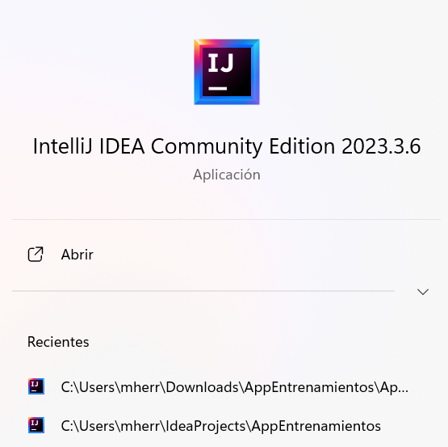
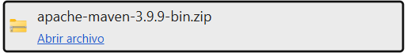
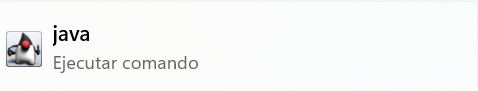

# README PRÁCTICA 1 
## MIGUEL HERREMANS - 202112838

En este README se podrá visualizar la práctica 1 de PAT realizada. Además, se mostrarán evidencias de la instalación de las aplicaciones requeridas para el desarrollo de la asignatura.

## INFORME DE COMANDOS

Ver el informe de la páractica completa en este archivo PDF:

[📄 Ver la documentación](docs/git.pdf)

### Imagen 1: Instalación VSCode

### Imagen 2: Instalación IntellIJ

### Imagen 3: Instalación Maven

### Imagen 4: Instalación Java

